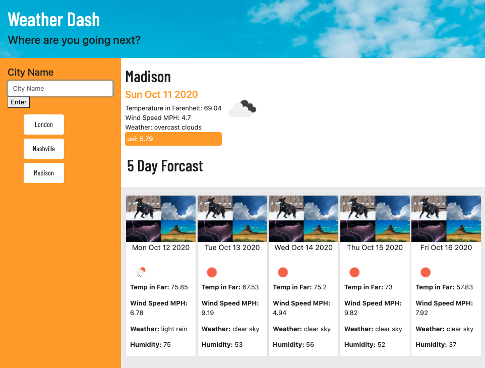

# 5 Day Weather Dash
​
## Creating a Weather Dash with OpenWeatherAPI

### Live site at [Weather Dash](https://cgsdesign.github.io/weather-dash/)
​
​For this project I created a webpage that displays current weather and a 5 day forecast for various city's around the world. I used OpenWeatherAPI to collect the data I needed. The page is designed to be visually enticing and encourage the user to get outside and consider traveling.

## Key Features
* daily forecasts based on city inputs
* weather icons and bright design targeting young travelers
* fully responsive design
* past city lookups to make searching easier
* color coded UV index
* clear internal documentation

## Credits
​
* Barlow Condensed font by Jeremy Tribby hosted by Google Fonts.
* Photo from Pexels
* Header Photo by Lisa Fotios from Pexels
* License text curtasy of https://choosealicense.com/licenses/mit/
​
​
## License

Copyright (c) 2020 Catherine Sibley

Licensed under the MIT license.

Permission is hereby granted, free of charge, to any person obtaining a copy of this software and associated documentation files (the "Software"), to deal in the Software without restriction, including without limitation the rights to use, copy, modify, merge, publish, distribute, sublicense, and/or sell copies of the Software, and to permit persons to whom the Software is furnished to do so, subject to the following conditions:

The above copyright notice and this permission notice shall be included in all copies or substantial portions of the Software.

THE SOFTWARE IS PROVIDED "AS IS", WITHOUT WARRANTY OF ANY KIND, EXPRESS OR IMPLIED, INCLUDING BUT NOT LIMITED TO THE WARRANTIES OF MERCHANTABILITY,
FITNESS FOR A PARTICULAR PURPOSE AND NONINFRINGEMENT. IN NO EVENT SHALL THE
AUTHORS OR COPYRIGHT HOLDERS BE LIABLE FOR ANY CLAIM, DAMAGES OR OTHER
LIABILITY, WHETHER IN AN ACTION OF CONTRACT, TORT OR OTHERWISE, ARISING FROM, OUT OF OR IN CONNECTION WITH THE SOFTWARE OR THE USE OR OTHER DEALINGS IN THE SOFTWARE.
